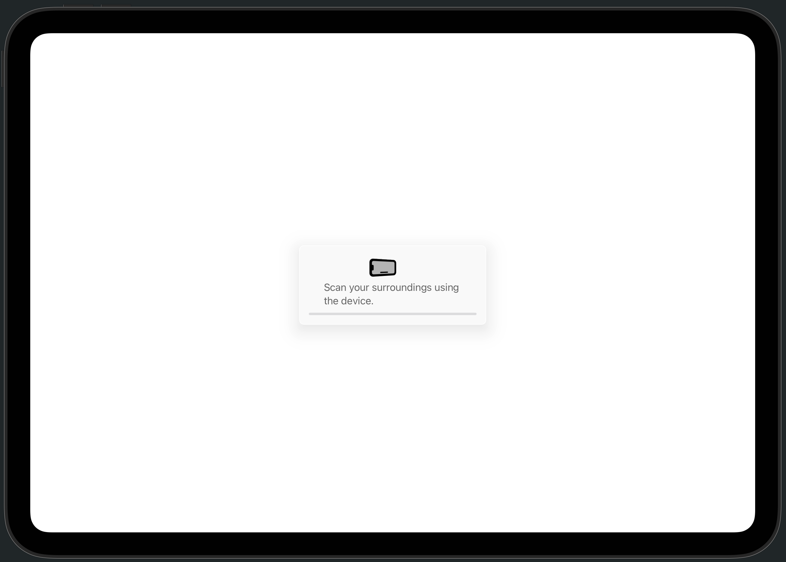
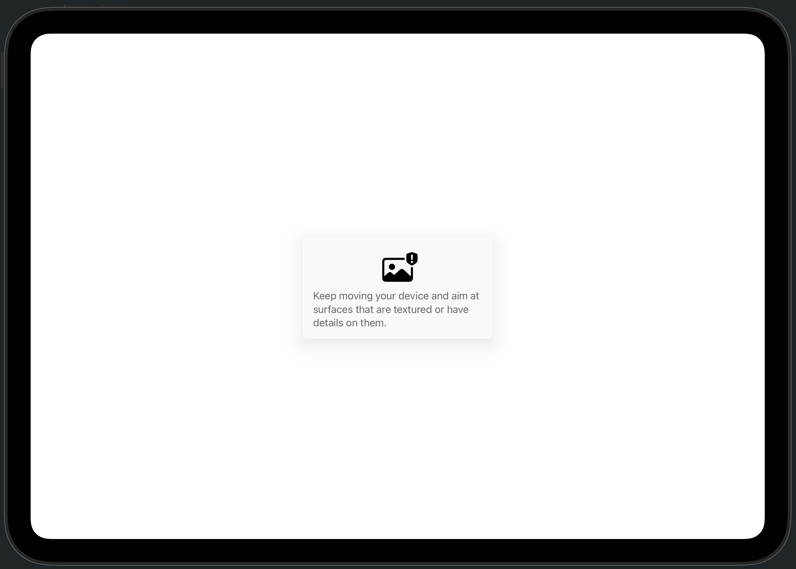
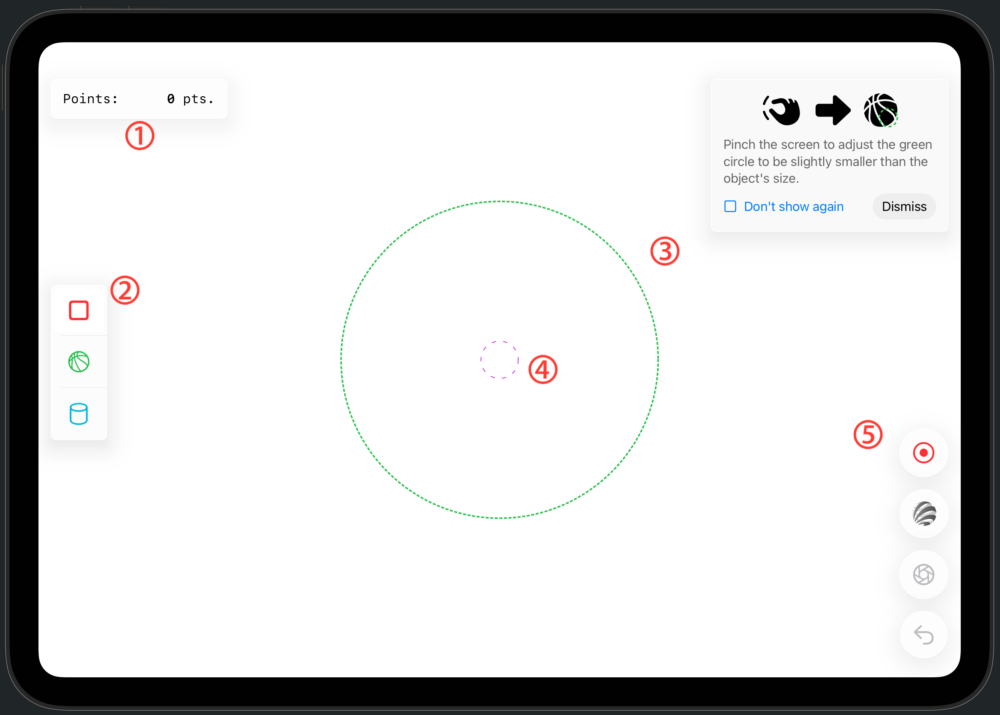

# FindSurface-GUIDemo-iOS-FeaturePoint (Swift)

**Curv*Surf* FindSurface™** GUIDemo using ARKit raw feature points for iOS (Swift)

## Overview

This demo app showcases a real-time application of FindSurface to detect geometric shapes in point clouds provided by ARKit.

The project retrieves [`rawFeaturePoints`](https://developer.apple.com/documentation/arkit/arframe/rawfeaturepoints) from the surrounding environment via [ARKit’s `ARFrame`](https://developer.apple.com/documentation/arkit/arframe), then uses FindSurface to detect geometry and overlays the results in AR rendering.

> **> How is this project different from [the previous project?](https://github.com/CurvSurf/FindSurface-GUIDemo-iOS/tree/main)**  
> The previous project required a LiDAR-equipped device, whereas this one supports **general iOS devices** (iPhone, iPad) that support ARKit, regardless whether it has a LiDAR sensor.

This demo runs on iPhone or iPad devices with iOS/iPadOS 18.6 or later, with or without LiDAR sensors. The OS version isn’t mandatory—you can simply pull the code from this repository and lower the OS version directly in your project settings.  

See what it looks like in action in the video below.

Click the thumbnail above or [here](https://www.youtube.com/watch?v=SIdQRiLj2jY) to watch the video on YouTube.

## Features

- Real-time detection of geometric surfaces in camera scenes;  
- Uses input raw feature points provided by ARKit;  
- Detected surfaces rendered as overlays (AR rendering);  
- A UI designed for simple and intuitive detection
- Filters samples of rawFeaturePoints statistically. [See below for details](#about-filtering-rawfeaturepoints).

## User Interface

1. When the app starts, a screen requesting you to scan your surroundings appears (as shown above).  
   This is a pre-stabilization step to ensure smooth AR experience by allowing the device’s motion tracking to stabilize.  
   Move your device smoothly as if scanning the surroundings with the camera. Once the progress bar at the bottom of the popup fills completely, the stabilization phase is complete.

2. During the stabilization phase, the progress may not advance and the guidance window will remain if:  
   - The device is stationary and the camera keeps seeing the same image;  
   - The camera is pointed at walls or surfaces lacking color, texture, or detail, or showing highly repetitive patterns;  
     (e.g., a plain solid-colored wall, a glass window, or a mirror filling the entire view)  
   - The camera points into empty space beyond ~10m;  
     (e.g., pointing at the sky outdoors)  

   *Because [ARKit’s `rawFeaturePoints`](https://developer.apple.com/documentation/arkit/arframe/rawfeaturepoints) are only detected within about 10m, outdoor use of this app may be somewhat limited.*

3. After stabilization, the main screen appears (as shown above):  

   - **①**: Displays the number of points currently visible on the screen.  
   - **②**: Lets you select the type of geometry to detect. Plane, sphere, and cylinder are supported.  
   - **③**: The green dotted circle represents the approximate size of the geometry to detect. You can adjust its size with a pinch gesture. Generally, setting it slightly larger than half the size of the actual object is recommended. (Note: precision is not critical here.) A tutorial window in the top-right corner explains these details; you can dismiss it if no longer needed. Checking *“Don’t show again”* ensures the popup will not appear even after restarting the app.  
   - **④**: To detect geometry, ensure that some of the nearby points fall inside the purple dashed circle. The size of this circle cannot be adjusted.  
   - **⑤**: From top to bottom, the following controls are available:  
     - **Point collecting toggle button**: Enables/disables point collection from the environment. The toggle is set to `enabled` by default (stop button visible). Long pressing the button (holding for about 0.5 seconds) clears the point buffer collected so far.  
     - **FindSurface toggle button**: Runs FindSurface detection on every frame and shows a preview of the detected geometry at the current pointing location. The toggle is set to `enabled` by default (disabled state shown with grayscale icon).  
     - **Capture button**: Captures the currently previewed geometry and places it as a fixed AR overlay in space.  
     - **Undo button**: Removes the most recently captured geometry. Long pressing the button (holding for about 0.5 seconds) removes all captured geometry.  

*Note: Unlike the image shown above, in runtime the background will display the live scene from the device’s camera instead of a white background.*  

### When Geometry or Point Clouds Appear in the Wrong Place

Unlike the [VisionOS samples](https://github.com/CurvSurf/FindSurface-visionOS?tab=readme-ov-file), which demonstrate persistent objects using a WorldAnchor, this app does not provide a feature to reload previously placed content after the device restarts or the app is terminated and relaunched. As long as the app remains in memory, it may resume from an inactive state and show the previous content as-is, but this is not always guaranteed.

In addition, as is sometimes seen in AR applications in general, when the running app becomes inactive (for example, when the Home button is pressed or the screen turns off briefly) and then returns, the following issues may occur:

- **AR content appears in the wrong place instead of where it was originally placed:**  
  Typically, ARKit can estimate the device’s movement during the pause–resume interval and restore the previous origin. If it fails, however, a new origin may be created at a different location, which causes the reference point of previously rendered content to shift. Scanning the surroundings may help ARKit rediscover the previously scanned area and restore the origin, but this is not guaranteed. In such cases, it is recommended to press and hold the **Point Collecting toggle button** and the **Undo button** for more than 0.5 seconds to reset and start a new session.

- **A drifting effect where content appears to endlessly float away:**  
  This can occur when motion tracking has not yet stabilized. It is recommended to scan the surroundings until the tracking stabilizes, then reset as described above, or alternatively, completely restart the app (see [this guide](https://support.apple.com/en-az/guide/iphone/iph83bfec492/ios) for instructions).

## About Filtering `rawFeaturePoints`

ARKit’s [`rawFeaturePoints`](https://developer.apple.com/documentation/arkit/arframe/rawfeaturepoints) provides, for each frame, the feature points detected in that frame along with the identifier assigned to each point. If the same identifier appears in more than one frame, this means ARKit considers two features detected at different frames to be samples of the same identity. In other words, they are different samples of the same feature.  

As shown in the image above, while the camera is moving, ARKit’s algorithm detects features across multiple frames. Owing to the inherent nature of the algorithm (a detailed discussion of which is outside the scope of this document), the positions of samples of the same feature detected in different frames are not exactly identical but are instead distributed with some error.  

The error distribution forms a kind of needle shape: it has a large variance in the direction aligned to the camera’s viewing direction. The figure above shows an accumulation of [`rawFeaturePoints`](https://developer.apple.com/documentation/arkit/arframe/rawfeaturepoints) feature samples drawn, taken from a ball placed on the floor. You can see that the distribution of points forms a needle-like shape, converging in a particular direction. This is because the device was moved around and scanned from the side toward which the needle is pointing.

Instead of simply averaging these samples, we use a **z-score filtering method** based on the distance of each sample from the mean position. We remove outlier samples that fall outside a certain range from the mean (±2σ, within 95%), and then use the mean of the remaining samples as the representative position of the feature. When new samples are added from other frames, we repeat the same filtering over the accumulated samples (keeping up to 100 per feature, discarding the oldest in FIFO manners if exceeded). If there is only a single sample, that point is used directly as the feature’s position without any statistical processing.  

<!--
# FindSurface-GUIDemo-iOS-FeaturePoint (Swift)

**Curv*Surf* FindSurface™** GUIDemo using ARKit raw feature points for iOS (Swift)

## Overview

This demo app demonstrates a real-time application using FindSurface to search point clouds, which ARKit provides, for geometry shapes.

이 프로젝트는 ARKit의 ARFrame으로부터 주변 환경의 rawFeaturePoints를 얻어내고 FindSurface를 이용해서 geometry를 검출하고 AR 렌더링으로 화면에 보여줍니다.

> [이전의 프로젝트](https://github.com/CurvSurf/FindSurface-GUIDemo-iOS/tree/main)와 무엇이 다른가요?
> 이전의 프로젝트는 LiDAR 탑재된 장비를 요구하는 반면, 이 프로젝트는 LiDAR가 탑재되지 않은, ARKit를 지원하는 일반적인 iOS 장치(iPhone, iPad)를 지원합니다.

이 데모는 iOS 또는 iPadOS 18.6 이상을 지원하는 iPhone 또는 iOS 기기에서 동작합니다.
(필수는 아니고 이 저장소의 코드를 내려받아서 프로젝트 설정에서 직접 OS 버전을 낮출수도 있습니다.)

See what it looks like in action in the video below.

Click the thumbnail above or [here](https://www.youtube.com/watch?v=SIdQRiLj2jY) to watch the video on YouTube.

## Features

- Real-time detection of geometry surfaces in camera scenes;
- Using input raw feature points provided by ARKit;
- Detected surfaces rendered in overlay (AR rendering);
- 최소한의 사용자 조작으로 간편하게 결과를 얻어낼 수 있게 설계된 간결한 UI 구성
- Filters samples of rawFeaturePoints statistically. [See below for details](#about-filtering-rawfeaturepoints).

## User Interface

1. 앱을 시작하면, 위의 이미지와 같이 주변 스캔을 요구하는 창이 나타납니다. 이는 원활한 AR 경험을 위해, 장치의 모션 트래킹을 안정화시키기 위한 사전 작업입니다. 장치를 들고 주변을 둘러보듯 카메라를 부드럽게 이동시키세요. 표시된 팝업창 하단의 progress bar가 완전히 차오르면 안정화 단계를 통과합니다.

2. 안정화 단계에서 다음과 같은 경우에 안정화 진행률이 오르지 않고 위와 같은 안내창이 뜹니다:

- 장치의 움직임이 멈춰서 카메라에 들어오는 이미지가 동일한 채로 유지되는 경우;
- 카메라가 색상이나 무늬/질감 또는 디테일이 없거나 동일한 패턴이 매우 규칙적으로 반복되는 벽을 보고있는 경우;
  (예: 화면을 가득 채우는 무늬없는 단색 벽, 유리창, 거울)
- 카메라가 약 10m 밖까지 아무것도 없는 허공을 가리키는 경우
  (예: 야외의 하늘)
*ARKit에서 rawFeaturePoints가 약 10m 이내로만 검출되는 한계로 인해, 이 앱은 야외에서 사용이 다소 제한적입니다.*

3. 안정화 단계를 끝마치면, 위와 같은 화면이 뜹니다.

- ①: 화면상에 나타나는 녹색 점의 개수를 표시합니다.
- ②: 검출할 geometry 유형을 결정합니다. 평면, 원, 원기둥이 지원됩니다.
- ③: 녹색 점선(dotted line)으로 그려진 원은 검출할 geometry의 대략적인 크기를 나타냅니다. 화면에 pinch 제스쳐를 이용해 크기를 조절할 수 있으며, 일반적으로 검출할 물체 크기의 절반보다 약간 큰 정도를 권장합니다. (참고: 아주 구체적으로 정확할 필요는 없습니다.) 우측 상단의 안내 창에서 이러한 내용을 소개하고 있으며, 더 이상 필요하지 않으면 dismiss를 눌러 앱이 실행중인 동안 창을 보이지 않게 할 수 있습니다. "Don't show again"에 체크하고 dismiss하면 앱을 재시작해도 더 이상 나타나지 않게 됩니다.
- ④: 사용자는 geometry 검출을 위해 목표지점 근처의 녹색 점들 일부가 이 보라색 파선(dashed) 원 안에 들어오게 해야 합니다. 이 원 안에 들어오는 점들 중 적절한 점이 자동으로 선택됩니다. 이 원의 크기는 조절할 수 없습니다.
- ⑤: 위에서부터 다음과 같은 기능을 제공합니다:
  - Point collecting 토글 버튼: 주변 환경으로부터 점 수집을 활성화/비활성화 합니다. 앱 시작시 기본값은 활성화(정지 버튼이 보임)로 되어있습니다. 약 0.5초간 길게 누르고 있면 이제까지 수집된 점 버퍼를 비웁니다.
  - Preview 토글 버튼: FindSurface로 매 프레임마다 검출을 실시하여 현재 가리키고 있는 지점으로부터 검출되는 geometry의 preview를 보여줍니다. 앱 시작시 기본값은 활성화(비활성화시 아이콘이 흑백으로 바뀜)
  - Capture button: 현재 preview에 나타나고 있는 geometry를 캡쳐하여 공간에 고정된 overlay로 표시합니다.
  - Undo button: 가장 최근에 검출한 captured geometry를 제거합니다. 약 0.5초간 길게 누르면 모든 geometry를 제거합니다.

*위의 이미지와 달리, 실제 런타임에서는 흰 배경 대신에 사용자의 장치 카메라가 바라보는 장면이 나타납니다.*

### Geometry 또는 point cloud가 올바르지 않은 위치에 나타날 경우

이 앱은 [VisionOS samples](https://github.com/CurvSurf/FindSurface-visionOS?tab=readme-ov-file)에서 WorldAnchor를 이용한 Persistent objects를 했던 것과 같이 장치가 재시작하거나 앱이 메모리에서 내려갔다가 재시작할 때에 이전에 있었던 컨텐츠를 다시 불러오는 기능을 제공하지 않습니다. 앱이 메모리에서 내려가지 않는 동안에는 비활성화 상태에서 다시 돌아왔을 때 이전 내용을 그대로 화면에 보여줄 수도 있지만, 항상 보장되는 것은 아닙니다.

또한, 일반적으로 AR applications에서 가끔 볼 수 있는 문제로서, 실행중인 앱이 비활성화(홈 버튼을 누르거나 장치의 스크린이 잠시 꺼진 경우 등)되었다가 다시 돌아올 때, 다음과 같은 현상이 나타나는 경우가 있습니다:

- AR contents가 원래 있던 곳 대신에 엉뚱한 위치에 나타나는 경우: 보통은 ARKit가 세션의 pause와 resume 사이에 일어난 장치의 위치 변화를 파악하여 이전의 원점(origin)을 찾아내지만, 이에 실패할 경우에는 다른 위치에 새로운 원점이 생기면서 이전에 렌더링하기로 약속했던 위치의 기준점이 바뀌기 때문에 생기는 문제입니다. 주변을 스캔하다보면 ARKit가 이전에 스캔했던 위치를 발견하고 원점을 복원하는 경우도 있지만, 항상 보장되지는 않습니다. 그러한 경우에는 **Point collecting toggle button**과 **Undo button**을 0.5초 이상 길게 눌러서 초기화하고 새로 작업을 시작하기를 권장합니다.

- 끝없이 어딘가를 향해 떠내려가듯이 draft 현상을 보이는 경우: Motion tracking이 안정화되지 않은 경우 발생합니다. 주변을 스캔해서 안정화한 뒤 위의 방법처럼 버튼을 길게 눌러 초기화하거나, 혹은 [여기](https://support.apple.com/en-az/guide/iphone/iph83bfec492/ios)를 참조하여 앱을 완전히 재시작하는 것을 권장합니다.

## About Filtering `rawFeaturePoints`

ARKit의 `rawFeaturePoints`는 매 프레임마다 해당 프레임에서 검출된 feature points와 각 point에 대응되는 identifier를 제공합니다. 둘 이상의 프레임에서 동일한 identifier를 부여받은 feature가 존재하는 경우, ARKit가 서로 다른 시점에 검출된 두 feature가 동일한 identity를 가진 지점을 서로 다른 시간과 위치에서 샘플링 한 것으로 간주한다는 것을 의미합니다. 즉, 동일한 feature에 대한 서로 다른 샘플입니다.  

위 이미지에서 보여지듯이, 카메라가 이동하는 동안에 ARKit의 알고리즘이 여러 frame에 걸쳐서 feature들을 검출하게 되는데, 그 알고리즘의 한계로 인해(이러한 알고리즘의 자세한 부분에 관하여 논의하는 것은 이 글의 범주를 벗어나므로 설명하지 않겠습니다.) 여러 프레임에서 검출된 동일한 feature의 샘플들의 위치는 완전히 동일하지 않고 어떤 오차를 가지고 분포하게 됩니다.  

이 오차 분포는 카메라가 바라보는 방향과 나란히 놓여지는 방향으로는 큰 분산을 갖는, 마치 바늘 모양을 이루게 됩니다. 위의 그림은 바닥에 놓인 공으로부터 `rawFeaturePoints`의 feature sample들을 필터링 없이 누적하여 그린 것입니다. 점들의 분포가 바늘 모양으로 특정한 방향으로 모여들듯이 일제히 한 곳을 향하는 것을 볼 수 있는데, 이는 그 바늘이 향하는 쪽에서 장치를 이리저리 움직이며 스캔했기 때문입니다.  

우리는 이 샘플들을 단순히 평균내는 대신에, 샘플의 평균 위치로부터 각 샘플의 거리에 대한 z-score filtering 방법을 이용해서 평균으로부터 일정 범위(+-2σ, 95% 이내) 밖에 해당하는 이상치 샘플들을 걸러낸 뒤 남은 샘플들의 평균 위치를 그 feature의 대표 위치로 사용합니다. 다른 frame에서 샘플이 추가되면 다시 누적된 전체 샘플(feature당 100개 유지, 초과시 FIFO 방식으로 오래된 샘플 폐기)에 대하여 동일한 필터링을 수행합니다. 샘플이 단 하나뿐인 경우에는 별도의 통계적인 처리 없이 그 점을 feature의 위치로 사용합니다.

-->